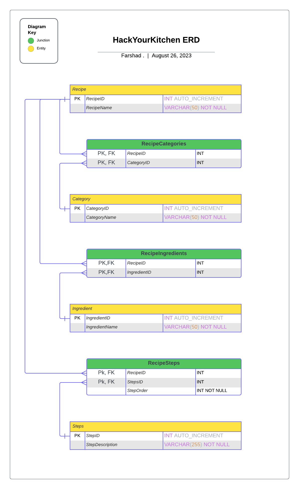

# ERD Diagram

### Normal Forms

#### Was the database already in 2NF / 3 NF?

- The database is in 2NF for the following reasons:

  - **It is in 1NF because:**
      1. **Single valued columns**: Each column contains atomic, indivisible values.
      2. **Unique names for columns**: Each column has a unique name to identify its data.
      3. **Order (of rows/columns) does not matter**: The order in which data is stored does not affect the integrity of the database.
      4. **Primary Key**: Each table has a primary key that uniquely identifies each record, ensuring that there are no duplicate records.
      5. **No duplicate records (every record has a primary key)**: This ensures data integrity and allows for efficient data retrieval.
      6. **Column domain (for any column) should not change**: The data type of a column remains consistent, ensuring data integrity.

  - **It is in 2NF because:**  
      1. **Fully Functionally Dependent**: All non-key attributes are fully functionally dependent on the primary key. This means there is no partial dependency of any column on the primary key.
